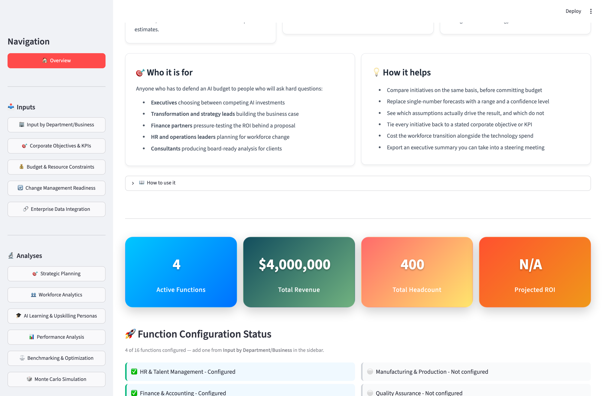
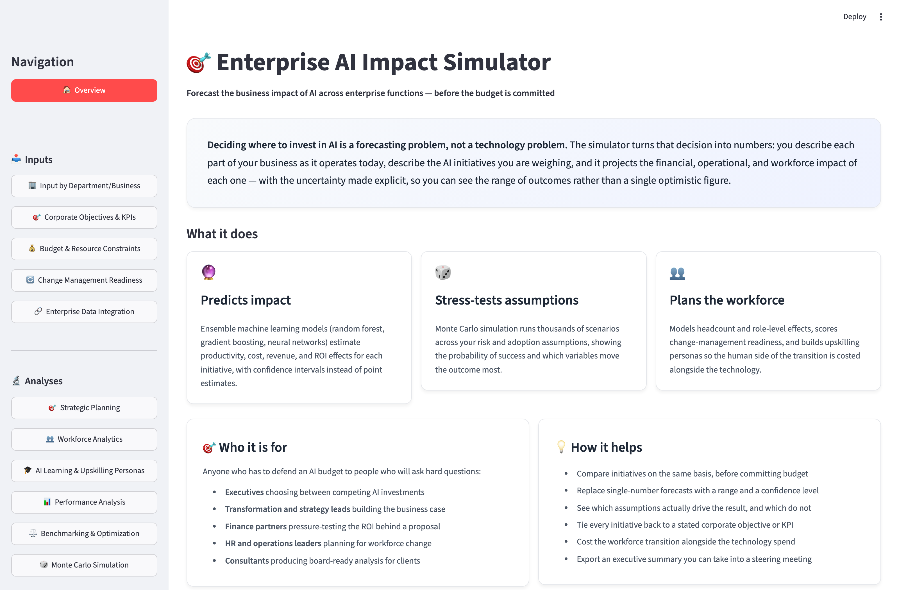

# Enterprise AI Impact Simulator

A Streamlit application that forecasts the business impact of AI across enterprise functions
before the budget is committed — combining ensemble ML prediction, Monte Carlo scenario
analysis, workforce planning, and industry benchmarking in one interface.



## Features

- **Predictive engine** — ensemble models (Random Forest, Gradient Boosting, Neural Networks)
  with uncertainty quantification and time-series forecasting
- **Monte Carlo simulation** — multi-scenario risk assessment and sensitivity analysis
- **Workforce analytics** — role-level impact modeling and upskilling personas
- **Strategic planning** — corporate objectives, budget constraints, change-management readiness
- **Benchmarking** — industry comparisons and scenario optimization
- **Enterprise integrations** — connectors for SAP, Oracle, Microsoft Dynamics, Workday,
  NetSuite, and Salesforce
- **AI assistant** — natural-language Q&A over your dashboard data (optional, needs an API key)

### The overview screen

Every visit opens on a plain-language explanation of what the simulator does, who it is for,
and how to work through it — the walkthrough expands on its own until you have data loaded.



## Running locally

```bash
python -m venv .venv
source .venv/bin/activate        # Windows: .venv\Scripts\activate
pip install -r requirements.txt
streamlit run app.py
```

The app opens at `http://localhost:8501`.

## Configuration

Both variables are optional — the app runs without either.

| Variable | Purpose | Fallback if unset |
| --- | --- | --- |
| `DATABASE_URL` | PostgreSQL connection string for persistent sessions | Local SQLite file (`ai_dashboard.db`) |
| `OPENAI_API_KEY` | Enables the AI Strategic Assistant page | Assistant shows a setup message; rest of the app is unaffected |

Set them as environment variables locally, or as secrets in your hosting platform.

> **Note on persistence:** without `DATABASE_URL`, the app writes to a local SQLite file.
> On ephemeral hosts (Streamlit Community Cloud, containers) that file is wiped on every
> restart. Point `DATABASE_URL` at a managed Postgres instance for durable sessions.

### Using PostgreSQL

The Postgres driver is an optional extra, because `psycopg2-binary` publishes no wheels
for the newest Python releases and would otherwise force a source build (requiring
`pg_config`) on hosts that default to them. Install it only when you need it:

```bash
pip install -r requirements.txt psycopg2-binary   # or: pip install .[postgres]
```

## Project structure

```
app.py                  # Entry point, sidebar navigation, overview screen
views/                  # Individual dashboard screens, rendered via show_*() functions
utils/                  # Core logic
  predictive_engine.py  # Ensemble ML forecasting
  monte_carlo.py        # Scenario simulation
  workforce_analytics.py# Role and headcount impact modeling
  database.py           # SQLAlchemy persistence (Postgres, SQLite fallback)
  visualization.py      # Plotly chart builders
  ...
```

## Tech stack

Python 3.11+ · Streamlit · Plotly · pandas / NumPy · scikit-learn · SQLAlchemy
